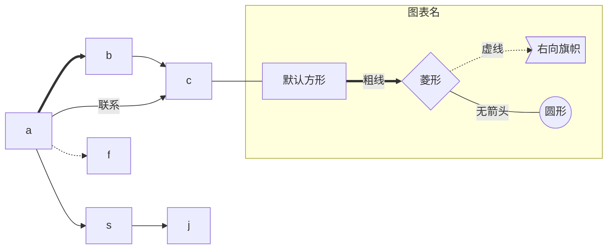
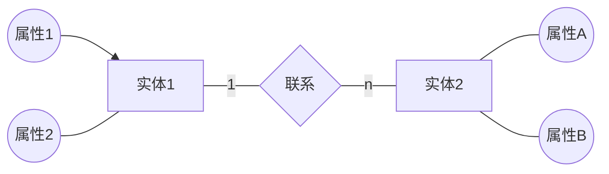
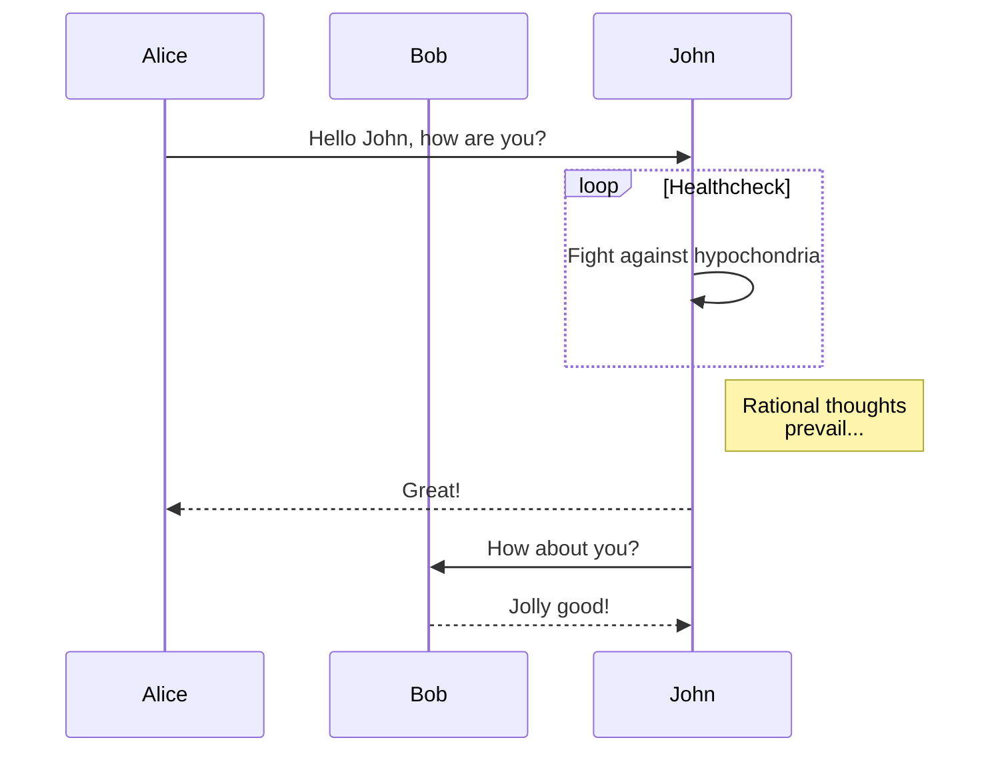
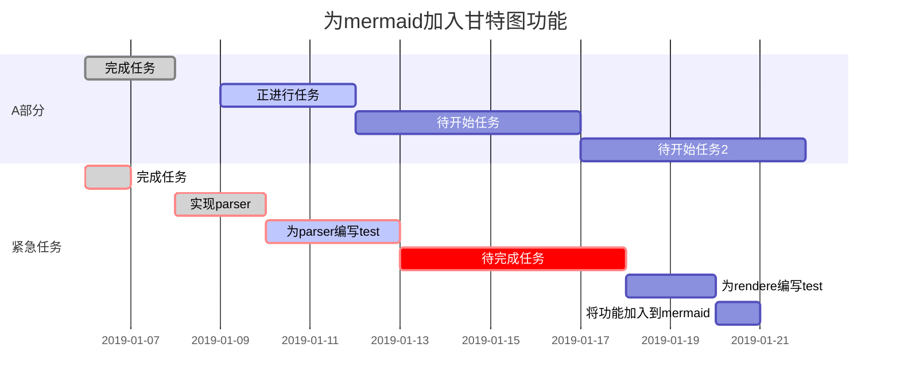

# MarkDown使用笔记

sublime text预览markdown效果: Ctrl+Alt+O

Markdown解析器
* PHP：https://github.com/SegmentFault/HyperDown
* JS ：https://github.com/SegmentFault/HyperDown.js

----

##文字

```
**我是粗体文本哦**
```
**我是粗体文本哦**

```
*我是斜体文本哦*
```
*我是斜体文本哦*

----

##引用文本
```
> this is a simple dialogure if you can see this article successful
> this is a simple dialogure if you can see this article successful
```
> this is a simple dialogure if you can see this article successful
> this is a simple dialogure if you can see this article successful

----

##链接
```
[aaaa][1]
[1]: http://www.baidu.com "baidu"
```
[aaaa][1]
[1]: http://www.baidu.com "baidu"

----

##图片
```
![bd_logo1][p1]
[p1]: http://www.baidu.com/img/bd_logo1.png "bd_logo1"
```
![bd_logo1][p1]
[p1]: http://www.baidu.com/img/bd_logo1.png "bd_logo1"

----

##无序列表
```
* aaaa
	* a1
		* a2
			* a3
				* a4
* bbbb
* cccc
```
* aaaa
	* a1
		* a2
			* a3
				* a4
* bbbb
* cccc

----

##有序列表
```
1. aaaa
	1.1. a1
2. bbbb
3. cccc
```
1. aaaa
	1.1. a1
2. bbbb
3. cccc

----

##表格
a|b|c
----|----|----
我是a|他是b|它是c
a is a man|b is a girl|c is a dog

----

##代码
```
	<?php
	if($a>$b){
	    echo $c=$a-$b;
	}
	?>
```
    <?php
    if($a>$b){
        echo $c=$a-$b;
    }
    ?>

##音乐

##视频
```
<iframe width="80%" height="400" frameborder="0" allowfullscreen="" src="http://v.qq.com/iframe/player.html?vid=a0174g18ljr&tiny=0&auto=0"></iframe>
```
<iframe width="80%" height="400" frameborder="0" allowfullscreen="" src="http://v.qq.com/iframe/player.html?vid=a0174g18ljr&tiny=0&auto=0"></iframe>

## 常用html

markdown分页导出pdf
在需要分页之处，插入代码：
<div STYLE="page-break-after: always;"></div>

## flow

> 定义元素语法
* tag=>type: content:>url
	* tag 就是元素名字，
	* type 是这个元素的类型，有6种类型
		* start ：开始
		* end ：结束
		* operation ：操作
		* subroutine ：子程序
		* condition ：条件
		* inputoutput ：输入或产出
	* content 就是在框框中要写的内容，注意type后的冒号与文本之间一定要有个空格。
	* url 是一个连接，与框框中的文本相绑定
> 连接元素语法

用 “ -> ” 来连接两个元素。
注：需要注意的是condition类型，因为他有yes和no两个分支，所以要写成：
c2(yes)->io->e
c2(no)->op2->e


```flow
st=>start: 开始语句
in=>inputoutput: 输入值
e=>end: 结束语句
op=>operation: 执行操作
cond=>condition: 是否成立？
out=>inputoutput: 输出值

st->in->op->cond
cond(yes)->out
cond(no)->op
out->e
```

## mermaid

> 设置mermaid主题
Markdown Preview Enhanced: Open Mermaid Config
添加：
//设置mermaid绘图的风格
//一共有三个主题：
// mermaid.css
// mermaid.dark.css
// mermaid.forest.css
Mermaid_Theme={
theme:mermaid.forest.css
}

### 语法

> 方向

|符号|意义|
|---|---|
| TB | 从上到下 |
| BT | 从下到上 |
| RL | 从右到左 |
| LR | 从左到右 |

> 连线类型

|符号|意义|
|---|---|
| `-->`| 添加尾部箭头 |
| `---`	| 不添加尾部箭头 |
| `--–`	| 单线 |
| `–-text–--` |	单线上加文字 |
| `==` |	粗线 |
| `==text==`	| 粗线加文字 |
| `-.-` | 虚线 |
| `-.text.-` | 虚线加文字|

> 节点

|表述|说明|
|---|---|
| id[文字]	 | 矩形节点			|
| id(文字)	 | 圆角矩形节点		|
| id((文字)) | 圆形节点			|
| id>文字]	 | 右向旗帜状节点	|
| id{文字}	 | 菱形节点			|

### Flowchart（流程图）



### ER图



### Sequence diagram(顺序图)



### 甘特图(Gantt diagram)

紧急任务：crit

任务状态：
done
active



## PlantUML

* 预先需要安装java和graphviz
    * brew cask install java
    * brew install graphviz
* 安装2个vscode插件:
    * PlantUML
    * Graphviz Preview

PlantUML是一个开源项目，支持快速绘制：

* 时序图
* 用例图
* 类图
* 活动图 (旧版语法在此处)
* 组件图
* 状态图
* 对象图
* 部署图
* 定时图

同时还支持以下非UML图:

* 线框图形界面
* 架构图
* 规范和描述语言 (SDL)
* Ditaa diagram
* 甘特图
* 思维导图
* Work Breakdown Structure diagram
* 以 AsciiMath 或 JLaTeXMath 符号的数学公式
* Entity Relationship diagram

通过简单直观的语言来定义这些示意图,与MarkDown有相似的作用，这两种语言一个主要面向文本渲染一个主要用于图形绘制。

> 语法

语法简单明了，查看以下官方教程 https://plantuml.com/zh/

> 例子

@startuml
Alice -> Bob: Authentication Request
Bob --> Alice: Authentication Response

Alice -> Bob: Another authentication Request
Alice <-- Bob: another authentication Response
@enduml

* 预览
    * Alt+D
* 文件格式
    * .wsd
    * .pu
    * .puml
    * .plantuml
    * .iuml
* 导出
    * F1/ctrl+shift+p
    * PlantUML:导出当前图表
    * 选择导出格式png