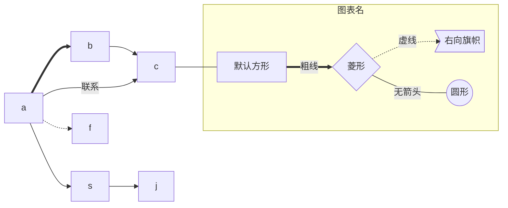
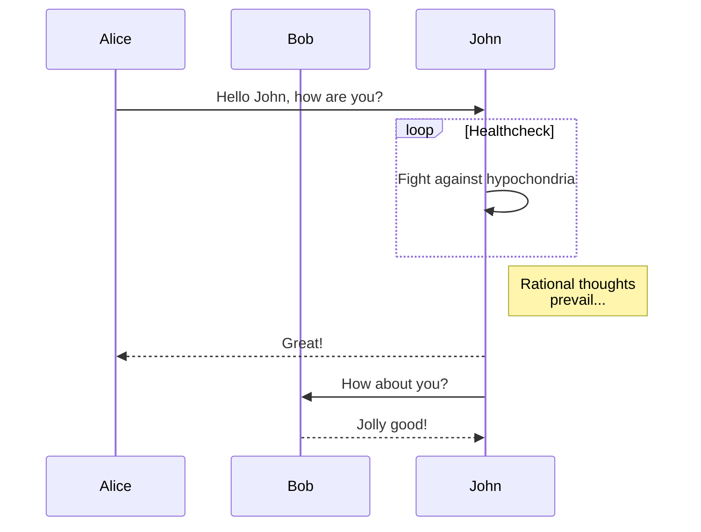
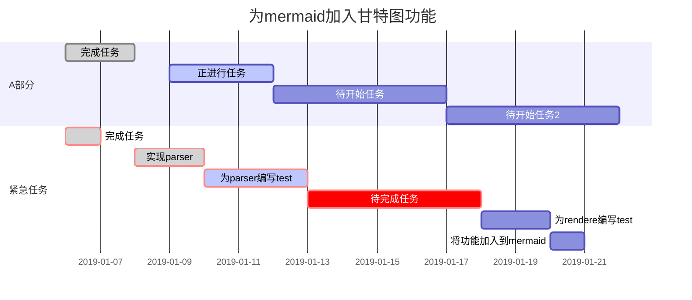

# MarkDown使用笔记

sublime text预览markdown效果: Ctrl+Alt+O

Markdown解析器
* PHP：https://github.com/SegmentFault/HyperDown
* JS ：https://github.com/SegmentFault/HyperDown.js

----

##文字

```
**我是粗体文本哦**
```
**我是粗体文本哦**

```
*我是斜体文本哦*
```
*我是斜体文本哦*

----

##引用文本
```
> this is a simple dialogure if you can see this article successful
> this is a simple dialogure if you can see this article successful
```
> this is a simple dialogure if you can see this article successful
> this is a simple dialogure if you can see this article successful

----

##链接
```
[aaaa][1]
[1]: http://www.baidu.com "baidu"
```
[aaaa][1]
[1]: http://www.baidu.com "baidu"

----

##图片
```
![bd_logo1][p1]
[p1]: http://www.baidu.com/img/bd_logo1.png "bd_logo1"
```
![bd_logo1][p1]
[p1]: http://www.baidu.com/img/bd_logo1.png "bd_logo1"

----

##无序列表
```
* aaaa
	* a1
		* a2
			* a3
				* a4
* bbbb
* cccc
```
* aaaa
	* a1
		* a2
			* a3
				* a4
* bbbb
* cccc

----

##有序列表
```
1. aaaa
	1.1. a1
2. bbbb
3. cccc
```
1. aaaa
	1.1. a1
2. bbbb
3. cccc

----

##表格
a|b|c
----|----|----
我是a|他是b|它是c
a is a man|b is a girl|c is a dog

----

##代码
```
	<?php
	if($a>$b){
	    echo $c=$a-$b;
	}
	?>
```
    <?php
    if($a>$b){
        echo $c=$a-$b;
    }
    ?>

##音乐

##视频
```
<iframe width="80%" height="400" frameborder="0" allowfullscreen="" src="http://v.qq.com/iframe/player.html?vid=a0174g18ljr&tiny=0&auto=0"></iframe>
```
<iframe width="80%" height="400" frameborder="0" allowfullscreen="" src="http://v.qq.com/iframe/player.html?vid=a0174g18ljr&tiny=0&auto=0"></iframe>

## flow

> 定义元素语法
* tag=>type: content:>url
	* tag 就是元素名字，
	* type 是这个元素的类型，有6种类型
		* start ：开始
		* end ：结束
		* operation ：操作
		* subroutine ：子程序
		* condition ：条件
		* inputoutput ：输入或产出
	* content 就是在框框中要写的内容，注意type后的冒号与文本之间一定要有个空格。
	* url 是一个连接，与框框中的文本相绑定
> 连接元素语法

用 “ -> ” 来连接两个元素。
注：需要注意的是condition类型，因为他有yes和no两个分支，所以要写成：
c2(yes)->io->e
c2(no)->op2->e


```flow
st=>start: 开始语句
in=>inputoutput: 输入值
e=>end: 结束语句
op=>operation: 执行操作
cond=>condition: 是否成立？
out=>inputoutput: 输出值

st->in->op->cond
cond(yes)->out
cond(no)->op
out->e
```

## mermaid

> 设置mermaid主题
Markdown Preview Enhanced: Open Mermaid Config
添加：
//设置mermaid绘图的风格
//一共有三个主题：
// mermaid.css
// mermaid.dark.css
// mermaid.forest.css
Mermaid_Theme={
theme:mermaid.forest.css
}

### 语法

> 方向

|符号|意义|
|---|---|
| TB | 从上到下 |
| BT | 从下到上 |
| RL | 从右到左 |
| LR | 从左到右 |

> 连线类型

|符号|意义|
|---|---|
| `>`| 添加尾部箭头 |
| `-`	| 不添加尾部箭头 |
| `–`	| 单线 |
| `–text–` |	单线上加文字 |
| `==` |	粗线 |
| `==text==`	| 粗线加文字 |
| `-.-` | 虚线 |
| `-.text.-` | 虚线加文字|

> 节点

|表述|说明|
|---|---|
| id[文字]	 | 矩形节点			|
| id(文字)	 | 圆角矩形节点		|
| id((文字)) | 圆形节点			|
| id>文字]	 | 右向旗帜状节点	|
| id{文字}	 | 菱形节点			|

### Flowchart（流程图）


```mermaid
graph LR;
a==>b;
b-->c;
a--联系-->c;
a-->s;
a-.->f;
s-->j;
c---id2;

subgraph 图表名;
        id2[默认方形]==粗线==>id3{菱形}
        id3-.虚线.->id4>右向旗帜]
        id3--无箭头---id5((圆形))
    end
```

### Sequence diagram(顺序图)


```mermaid
sequenceDiagram
    participant Alice
    participant Bob
    Alice->>John: Hello John, how are you?
    loop Healthcheck
        John->>John: Fight against hypochondria
    end
    Note right of John: Rational thoughts <br/>prevail...
    John-->>Alice: Great!
    John->>Bob: How about you?
    Bob-->>John: Jolly good!
```

### 甘特图(Gantt diagram)

紧急任务：crit

任务状态：
done
active


```mermaid
gantt
    dateFormat  YYYY-MM-DD
    title 为mermaid加入甘特图功能
    section A部分
    完成任务        :done, des1,2019-01-06,2019-01-08
    正进行任务      :active, des2,2019-01-09,3d
    待开始任务      :des3, after des2, 5d
    待开始任务2     :des4, after des3, 5d
    section 紧急任务
    完成任务        :crit,done,2019-01-06,24h
    实现parser     :crit,done,after des1, 2d
    为parser编写test :crit, active, 3d
    待完成任务      :crit,5d
    为rendere编写test: 2d
    将功能加入到mermaid: 1d
```

